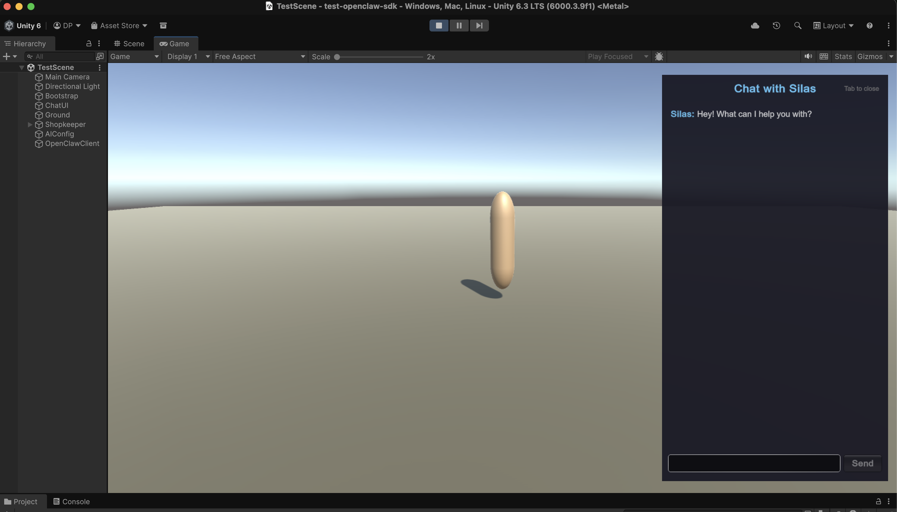

# OpenClaw Worlds

**AI agents that live inside Unity. They build towns, run businesses, remember everything, and do real work.**



OpenClaw Worlds is a Unity SDK that connects [OpenClaw](https://openclaw.ai) AI agents to your game. Agents don't just chat — they generate entire towns from JSON, modify weather and physics at runtime, hot-reload C# code, and accumulate persistent memory across sessions.

```
You: "Build me a frontier town with a saloon, bank, and sheriff's office"
Agent: *spawns a full town with buildings, interiors, NPCs, street lamps, and hitching posts*
Agent: *each building has a furnished interior with a shopkeeper who remembers your conversations*
```

---

## Prerequisites

Before you start, you need two things installed:

### Unity

Download and install **Unity 2021.3 LTS or newer** from [unity.com/download](https://unity.com/download). The SDK works with any render pipeline (Built-in, URP, HDRP). When creating a new project, the **3D** template is fine.

### OpenClaw

Install the OpenClaw CLI and run the onboarding wizard:

```bash
curl -fsSL https://openclaw.ai/install.sh | bash
openclaw onboard
```

The onboarding wizard walks you through:
- Adding your AI provider API key (OpenAI, Anthropic, Google, etc.)
- Creating your first agent
- Starting the local gateway on `ws://127.0.0.1:18789`

After onboarding, your gateway runs automatically. You can check it anytime with `openclaw doctor`.

> **Troubleshooting:** If the SDK shows "Auth failed" or agents return API key errors, run `openclaw doctor` to diagnose. Common fixes: restart the gateway (`openclaw gateway restart`), or check that your agent has API keys configured (`openclaw agents` to list agents).

---

## Quick Start (5 minutes)

### Step 1: Create a Unity project

Open Unity Hub, click **New Project**, select the **3D** template, name it whatever you want.

### Step 2: Add the SDK

Open `Packages/manifest.json` in your project folder and add this line to `"dependencies"`:

```json
"com.openclaw.worlds": "https://github.com/devinpicciolini/openclaw-worlds.git"
```

Or if you cloned the repo locally: `"com.openclaw.worlds": "file:../openclaw-worlds"`

Unity will import the package automatically when you switch back to the editor.

### Step 3: Configure your gateway token

Create the file `Assets/StreamingAssets/ai_config.json`:

```json
{
  "gatewayToken": "your-token-here",
  "gatewayWsUrl": "ws://127.0.0.1:18789",
  "agentId": "your-agent-name",
  "assistantName": "Your Agent Name",
  "personality": "You are a helpful architect who builds worlds. You speak with confidence and get things done."
}
```

**Where to find your token:** Run `openclaw doctor` in terminal — it shows your gateway config. Or check `~/.openclaw/openclaw.json` under `gateway.auth.token`.

**Where to find your agent name:** Run `openclaw agents` or check `~/.openclaw/openclaw.json` under `agents.list` — use the `id` of your default agent.

### Step 4: Set up your scene

1. Create an empty GameObject in your scene (right-click Hierarchy > Create Empty)
2. Name it "Bootstrap"
3. In the Inspector, click **Add Component** > search for `MinimalBootstrap`
4. Hit **Play**

### Step 5: Chat

You'll see **"Connected to OpenClaw"** in the top-left corner. Press **Tab** to open the chat panel. Type a message, press **Enter**. You're talking to your AI agent. Ask it to build a town — it'll spawn one in real-time with NPCs you can walk up to and talk to by pressing **E**.

That's it. You're done.

---

## Asset Packs (Optional)

The SDK works with **zero art assets** out of the box. Buildings are procedurally generated from primitives — colored walls, roofs with overhangs, doors with frames, windows on all sides, awnings with posts, chimneys, and text signs. NPCs are capsules, street lamps are cylinders with point lights. It's functional enough to prototype an entire AI-powered game before plugging in real art.

When you want real visuals, plug in an asset pack:

### POLYGON Western by Synty Studios (Paid)

The original game this SDK was extracted from was built with [POLYGON Western](https://syntystore.com/products/polygon-western-frontier-low-poly-3d-art) — 1,900+ low-poly western models. Saloons, banks, churches, wagons, barrels, NPCs, the works.

### POLYGON Starter Pack by Synty Studios (Free)

[POLYGON Starter Pack](https://assetstore.unity.com/packages/3d/props/polygon-starter-pack-low-poly-3d-art-by-synty-156819) is free on the Unity Asset Store. It includes basic buildings, props, characters, and environmental pieces — enough to get started with real 3D models.

### Any Other Asset Pack

The SDK doesn't care what art you use. Implement `IAssetMapper` to map building types to your prefab names:

```csharp
using OpenClawWorlds;
using OpenClawWorlds.World;

public class MyAssetMapper : DefaultAssetMapper
{
    public override string GetBuildingPrefab(BuildingDef def)
    {
        return def.zone switch
        {
            Zone.Saloon => "MyPack_Saloon_01",
            Zone.Bank   => "MyPack_Bank_01",
            _           => null  // falls back to primitives
        };
    }
}

// Register before spawning any towns
BuildingBuilder.AssetMapper = new MyAssetMapper();
```

After importing your asset pack, configure the prefab search paths:

```csharp
PrefabLibrary.SearchPaths = new[] { "YourPack/Buildings/", "YourPack/Props/", "" };
PrefabLibrary.PrimaryTextureName = "YourPack_Texture_01";
```

See [Asset Pack Integration](Documentation~/asset-pack-integration.md) for the full guide.

---

## Give Any NPC Its Own AI Agent

Add `NPCData` to any GameObject. That NPC now has its own AI agent with a unique personality, and persistent NPCs remember every conversation across sessions.

```csharp
// 1. Add identity to any GameObject
var data = npc.AddComponent<NPCData>();
data.Init("Bartender", "What'll it be, stranger?",
    new[] { "Drinks", "Town gossip", "Rooms" },
    isPersistent: true,
    personalityDesc: "Gruff but kind-hearted. Suspicious of strangers. Loves whiskey.");

// 2. When the player walks up, acquire an agent
AgentPool.Instance.AcquireAgent(npcData,
    onReady: (agentId) => { /* agent is live — start chatting */ },
    onError: (err)     => { /* falls back to main agent */ });

// 3. When the player walks away, release it
AgentPool.Instance.ReleaseAgent();
```

Personality descriptions and offerings are automatically injected into the agent's IDENTITY.md — the AI knows who it is, what it offers, and how to behave.

**Persistent NPCs** (like a bartender or sheriff) get a dedicated agent ID and their own memory file at `~/.openclaw/npc-memories/bartender.md`. Every conversation is appended — they remember what you told them last week.

**Disposable NPCs** (random townsfolk) share a rotating agent slot so you're not burning resources on background characters.

The built-in `OpenClawChatUI` handles all of this automatically. Walk up to any NPC and press **E** to start talking — the SDK detects the nearest NPC, acquires an agent, and routes your messages. Press **Tab** to chat with the main agent, press **Enter** to send.

```
~/.openclaw/
├── npc-memories/
│   ├── bartender.md       # Every conversation the bartender has had
│   ├── sheriff.md         # Every conversation the sheriff has had
│   └── shopkeeper.md      # Every conversation the shopkeeper has had
└── workspace-npc-bartender/
    ├── memory/            # Agent-local working memory
    └── skills/            # Symlinked global skills
```

---

## World Generation & Runtime Effects

The SDK also implements three protocols that let agents control your Unity world:

### CityDef — JSON that builds worlds

An agent returns a JSON block, and an entire town appears in your scene. Streets, buildings with furnished interiors, props, wandering NPCs — all from one structured response.

```csharp
string summary = CityDefSpawner.Build(cityDefJson, spawnOrigin, out Vector3 townPos);
```

### BehaviorDef — JSON that changes the rules

Agent returns JSON, and the weather changes. Rain particles follow the player, fog rolls in, torches flicker, gravity shifts. No compilation, no scene reload — same-frame execution.

### C# Hot Reload — code that compiles live

Agent writes C# code blocks, and they compile and run in the editor.

---

## Built-in Chat UI

The SDK ships with `OpenClawChatUI` — a zero-setup chat window. The panel docks to the right side of the screen so you can see your scene while chatting.

**Controls:**
- **Tab** — open/close chat with the main agent
- **E** — talk to the nearest NPC (walk up to any NPC and press E)
- **Enter** — send message

**Features:**
- **NPC interaction** — walk up to any NPC, see "Press E to talk to [name]", start chatting. Agent acquired automatically.
- **Chat tab** — talk to the main agent or nearest NPC agent
- **Skills tab** — live list of all available OpenClaw skills from the gateway
- **Crons tab** — scheduled cron jobs and their status
- **Quick action presets** — one-tap buttons for common requests ("Build me a small town", "Make it rain", etc.)
- **CityDef audit loop** — validates agent JSON and auto-retries until it passes (up to 2 attempts)
- **Agent identity injection** — on connect, pushes an IDENTITY.md to your agent so it knows it's inside a Unity game, what it can build, and how to use its tools

MinimalBootstrap creates it automatically. For your own scripts, add it to any GameObject:

```csharp
using OpenClawWorlds.UI;

gameObject.AddComponent<OpenClawChatUI>();
```

Walk up to any NPC and press **E** to start a conversation — the SDK automatically detects the nearest NPC, spins up a dedicated agent, and routes your messages. When there's no NPC nearby, it talks to your main agent from `ai_config.json`. Every response is automatically processed through all three protocols — if the agent returns CityDef JSON, a town appears; if it returns BehaviorDef, weather changes; if it returns C# code, it compiles live. Replace it with your own UI when you're ready for production.

---

## Built-in Player Controller

The SDK includes `SimplePlayerController` — a drop-in third-person WASD + mouse-orbit controller. No prefab needed, just add it to a GameObject:

```csharp
using OpenClawWorlds.Player;

gameObject.AddComponent<SimplePlayerController>();
```

- **WASD** to move, **Shift** to sprint, **Space** to jump
- Third-person camera that orbits around the player (mouse to orbit, scroll to zoom)
- Cursor automatically unlocks when chat is open, re-locks when closed
- Auto-finds and attaches the scene camera
- **E** to interact with nearby NPCs (handled by the chat UI)

---

## How It Works

```
┌──────────────────────────────────────────────────┐
│                  Your Game                        │
│  ┌───────────┐  ┌───────────┐  ┌──────────────┐  │
│  │  Player   │  │  Chat UI  │  │  Game Logic  │  │
│  │ Controller│  │(built-in) │  │   (yours)    │  │
│  └─────┬─────┘  └─────┬─────┘  └──────┬───────┘  │
│        │              │               │           │
├────────┼──────────────┼───────────────┼───────────┤
│        │     OpenClaw Worlds SDK      │           │
│  ┌─────▼──────────────────────────────▼────────┐  │
│  │              Gateway Layer                   │  │
│  │  OpenClawClient <-> GatewayConnection       │  │
│  └───────────────────┬─────────────────────────┘  │
│                      │                            │
│  ┌───────────────────▼─────────────────────────┐  │
│  │              Protocols                       │  │
│  │  CityDef     BehaviorDef     HotReload      │  │
│  │  (JSON->Town) (JSON->FX)   (C#->Compile)    │  │
│  └───────────────────┬─────────────────────────┘  │
│                      │                            │
│  ┌───────────────────▼─────────────────────────┐  │
│  │              World Builders                  │  │
│  │  BuildingBuilder  PropBuilder  NPCBuilder    │  │
│  │  InteriorBuilder  TownStreamer               │  │
│  └───────────────────┬─────────────────────────┘  │
│                      │                            │
│  ┌───────────────────▼─────────────────────────┐  │
│  │              Agents                          │  │
│  │  AgentPool (lifecycle, identity, memory)     │  │
│  └─────────────────────────────────────────────┘  │
│                                                   │
└───────────────────────────────────────────────────┘
          │
          v WebSocket (JSON-RPC)
┌──────────────────────┐
│   OpenClaw Gateway    │
│  (openclaw gateway)   │
└──────────────────────┘
```

---

## Core Concepts

### Event-Based Interactions

Subscribe to static events — no singletons to fight:

```csharp
Interactable.OnNPCInteract += (interactable, actor) =>
{
    var npc = interactable.GetComponent<NPCData>();
    OpenMyChatWindow(npc);
};

Interactable.OnDoorInteract += (interactable, actor) =>
{
    TeleportPlayer(interactable.TeleportPosition, interactable.TeleportYaw);
};

ZoneTrigger.OnZoneEntered += (zone) => UpdateMinimap(zone);
```

### TARDIS Interiors

Building interiors are 3.5x larger than the exterior — spacious from inside, proportional from outside. Each `InteriorStyle` gets auto-generated furniture: bars and stools in saloons, pews and altars in churches, anvils and forges in smithies, jail cells with bars in the sheriff's office. 12 fully furnished interior styles.

---

## Configuration Reference

### Gateway Connection

Create `Assets/StreamingAssets/ai_config.json` (recommended):

```json
{
  "gatewayToken": "your-token",
  "gatewayWsUrl": "ws://127.0.0.1:18789",
  "agentId": "your-agent",
  "assistantName": "Your Agent"
}
```

Or configure via code:

```csharp
var config = gameObject.AddComponent<AIConfig>();
config.gatewayWsUrl = "ws://127.0.0.1:18789";
config.gatewayToken = "your-token";
config.agentId = "default";
```

### World Builders

```csharp
BuildingBuilder.AssetMapper = new MyAssetMapper();   // Custom prefab mapping
InteriorBuilder.InteriorScale = 3.5f;                // TARDIS interior multiplier
PrefabLibrary.SearchPaths = new[] { "MyPack/", "" }; // Prefab search paths
```

### Agent Pool

```csharp
AgentPool.PrimaryAgentId = "my-agent";
AgentPool.DisposableSlotId = "npc-townfolk";
AgentPool.CustomBootstrap = (agentId) => { /* custom setup */ };

// Override identity generation (basic)
AgentPool.CustomIdentityBuilder = (name, greeting) => "...";

// Override with full context (personality, offerings)
AgentPool.CustomIdentityBuilderEx = (name, greeting, personality, offerings) => "...";
```

---

## Package Structure

```
Runtime/
├── Core/           # Enums, materials, prefab loading
├── Gateway/        # WebSocket transport + JSON-RPC client
├── Protocols/      # CityDef, BehaviorDef, HotReload
├── Agents/         # Agent lifecycle, memory, NPC data
├── Player/         # Drop-in third-person controller (WASD + orbit camera)
├── World/          # Building, prop, NPC, interior builders + IAssetMapper
├── UI/             # Built-in chat UI with Skills/Crons tabs
├── Validation/     # CityDef audit pipeline
└── Utilities/      # JSON parsing helpers

Samples~/
└── MinimalSetup/   # One scene, one NPC, one agent -- start here

Documentation~/
├── getting-started.md        # Full setup walkthrough
├── citydef-schema.md         # CityDef JSON reference
├── behaviordef-schema.md     # BehaviorDef JSON reference
└── asset-pack-integration.md # Plugging in custom art packs
```

---

## Documentation

| Doc | What it covers |
|-----|---------------|
| **[Getting Started](Documentation~/getting-started.md)** | Installation, gateway setup, first interactive scene |
| **[CityDef Schema](Documentation~/citydef-schema.md)** | Complete JSON schema for town generation |
| **[BehaviorDef Schema](Documentation~/behaviordef-schema.md)** | JSON schema for runtime effects |
| **[Asset Pack Integration](Documentation~/asset-pack-integration.md)** | How to plug in any 3D asset pack via `IAssetMapper` |

---

## Troubleshooting

| Issue | Fix |
|-------|-----|
| "Connecting..." forever | Is the gateway running? Run `openclaw doctor` |
| "Auth failed" in HUD | Check gateway token in `ai_config.json`. Run `openclaw doctor` |
| Agent returns API key errors | Agent needs API keys: `openclaw agents add <id>` or copy `auth-profiles.json` from your main agent |
| NPC chat goes to wrong agent | SDK auto-detects nearest NPC. Close and reopen chat (Tab) to re-detect |
| Buildings spawn but are invisible | Check render pipeline. SDK auto-detects URP/Built-in/HDRP but needs shaders included in build |
| "No shader available" error | Include shader variants in Project Settings > Graphics > Always Included Shaders |

---

## Requirements

- **Unity 2021.3 LTS** or newer (any render pipeline)
- **.NET Standard 2.1** or .NET Framework 4.x
- **OpenClaw** installed and gateway running
- Zero third-party dependencies

## License

MIT — see [LICENSE](LICENSE).
